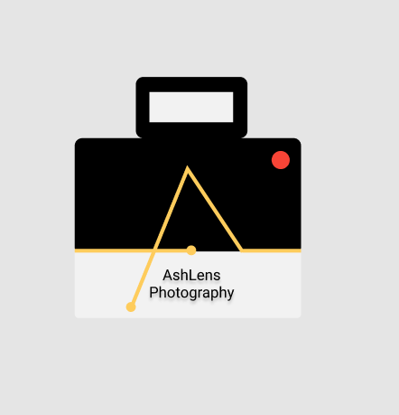
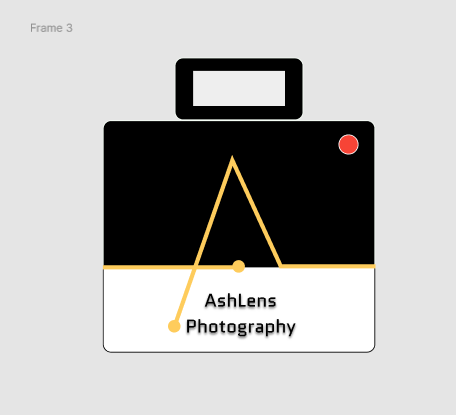
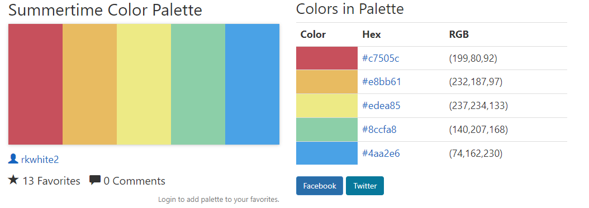
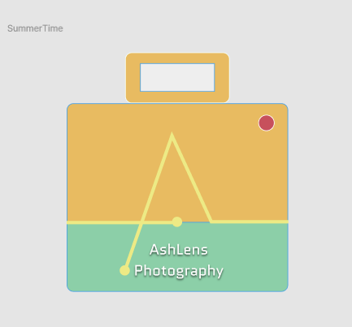

# DSGN270 // SVG Logo Design - Assignment 3 // Bryan Velasco

## TODO:

- create logo (added directly onto the HTML page)
  - must be styled with CSS
- create 2 alternative versions of logo (added using the `img` tag)

### Mood Board

**Description of Design**

I am going for a photography business logo.

- I want something that is simple and makes it obvious what kind of business this is

So starting this assignment off, I had already made a logo during class when we were learning about SVGs. I'll post an image.

But I did not feel like it was properly aligned and I wanted to do a better one. Same design but more symetrical.

**REMASTERED**

Now to look for some colour templates to find some colours that work well together.

**LOGO W/ SUMMERTIME PALETTE**

Now to add it to my VScode.

In order to figure out what each path did, I went in and changed the `fill` values to see what changed. From there I would comment what it is and tried to make classes that made logical sense to me.

After that, I had a prototype on figma of what I wanted this new logo to look like. So I just ported over all of the colours and completed that portion of the assignment.

Next was styling the page and SVGs with CSS. It took a bit to figure out how to group everything so that I could make it look good but eventually we got there.

All logos are visible without the need to scroll but there is a scroll bar.

Some problems that I encounted we trying to re-size the SVGs. Once the SVGs are passed through SVG OMG then it gets rid of the `viewbox` so you are left with just a height and width and if you delete those then it won't display the SVG.

So using CSS and my previous knowledge, I tried to my best to make all of the logos fit and wrap properly. There is a tiny sideways scroll on mobile but all of the important content is always visible.
